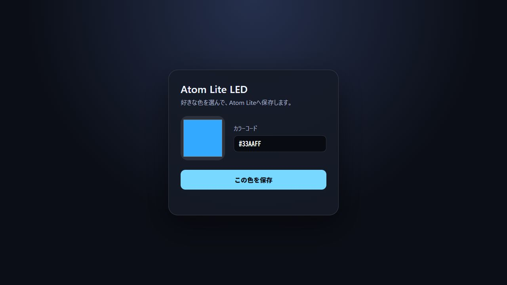

# AtomLite LED Web Palette

Control the built-in RGB LED on an M5Stack Atom Lite from a web browser.

M5Stack Atom Liteの内蔵RGB LEDを、スマートフォンやPCのWebブラウザーから操作するサンプルです。

[日本語](#日本語) | [English](#english)

## Screenshot / スクリーンショット



---

## 日本語

### 概要

Atom Lite上で小さなWebサーバーを動かし、ブラウザーのカラーパレットから内蔵RGB LEDの色を変更できます。
「この色を保存」を押すと選択した色がLEDへ反映され、Atom Liteの不揮発領域へ保存されます。電源を入れ直しても最後に保存した色が復元されます。

### 機能

- スマートフォンやPCのブラウザーからLEDの色を選択
- `#RRGGBB`形式のカラーコード入力に対応
- 保存した色を再起動後に自動復元
- LAN内のIPアドレスまたは `http://atomlite.local/` からアクセス
- Wi-Fi設定がない場合や接続に失敗した場合は、アクセスポイントモードへ自動切替
- HTML、CSS、JavaScriptをAtom Lite本体へ組み込むため、別のWebサーバーは不要

### 必要なもの

- [M5Stack Atom Lite](https://docs.m5stack.com/en/core/atom_lite)
- データ通信対応USB Type-Cケーブル
- Windows、macOS、またはLinuxを搭載したPC
- [Visual Studio Code](https://code.visualstudio.com/)
- [PlatformIO IDE for VS Code](https://docs.platformio.org/en/latest/integration/ide/vscode.html)
- 2.4 GHz Wi-Fi（家庭や社内のWi-Fiへ接続する場合）

> [!IMPORTANT]
> Atom Liteは5 GHz Wi-Fiへ接続できません。`XXXX-5G`などではなく、2.4 GHz側のSSIDを指定してください。

### セットアップ

#### 1. プロジェクトを開く

このリポジトリをGitでクローンするか、GitHubの「Code」→「Download ZIP」からダウンロードして展開します。
VS Codeを起動し、「ファイル」→「フォルダーを開く」で、`platformio.ini`があるフォルダーを開きます。

PlatformIOを初めて使用する場合は、VS Codeの「拡張機能」で `PlatformIO IDE` を検索してインストールし、VS Codeを再起動してください。

#### 2. Wi-Fiを設定する

`include/wifi_config.example.h`をコピーし、コピーしたファイルの名前を`wifi_config.h`へ変更します。

```text
include/
├── wifi_config.example.h
└── wifi_config.h          ← 作成するファイル
```

`include/wifi_config.h`を開き、接続する2.4 GHz Wi-FiのSSIDとパスワードを入力します。

```cpp
#pragma once

#define WIFI_SSID "YOUR_2_4_GHZ_WIFI_SSID"
#define WIFI_PASSWORD "YOUR_WIFI_PASSWORD"
```

`include/wifi_config.h`は`.gitignore`へ登録されています。通常はGitHubへアップロードされませんが、公開前にパスワードが含まれていないことを必ず確認してください。

Wi-Fiを設定せず、後述のアクセスポイントモードだけで使用することもできます。

#### 3. Atom Liteへ書き込む

1. Atom Liteをデータ通信対応USB Type-CケーブルでPCへ接続します。
2. VS Code下部にあるPlatformIOのチェックマーク（Build）を押してビルドします。
3. 矢印（Upload）を押してAtom Liteへ書き込みます。
4. プラグアイコン（Serial Monitor）を押し、115200 bpsで起動メッセージを確認します。

PlatformIO Coreを使用する場合は、プロジェクトのフォルダーで次のコマンドを実行できます。

```shell
# ビルド
pio run

# Atom Liteへ書き込み
pio run --target upload

# シリアルモニター
pio device monitor --baud 115200
```

### Web画面を開く

#### 通常のWi-Fiへ接続できた場合

シリアルモニターへ次のように表示されます。

```text
Wi-Fiに接続しました。
URL: http://atomlite.local/
IP : http://192.168.1.23/
Webサーバーを開始しました。
```

Atom Liteと同じネットワークへ接続したスマートフォンまたはPCから、表示されたURLを開きます。

- `http://atomlite.local/`
- シリアルモニターへ表示されたIPアドレス（例：`http://192.168.1.23/`）

端末やネットワークによっては`.local`を利用できません。その場合はIPアドレスを使用してください。

#### アクセスポイントモードの場合

Wi-Fi設定がない場合、または15秒以内に指定したWi-Fiへ接続できなかった場合、Atom Lite自身がアクセスポイントになります。

```text
アクセスポイントモードで起動しました。
SSID: AtomLite-LED
PASS: atomlite
URL : http://192.168.4.1/
```

スマートフォンまたはPCを次のWi-Fiへ接続してから、ブラウザーでURLを開きます。

- Wi-Fi名：`AtomLite-LED`
- パスワード：`atomlite`
- URL：`http://192.168.4.1/`

「インターネットへ接続されていません」と表示されても、この操作では問題ありません。

### LEDの色を変更する

1. Web画面のカラーパレットから色を選択します。
2. 必要に応じてカラーコードを編集します。
3. 「この色を保存」を押します。
4. Atom Liteの内蔵LEDが選択した色へ変わります。

色は「この色を保存」を押した時だけLEDへ反映されます。

### プロジェクト構成

```text
.
├── include/
│   ├── wifi_config.example.h  Wi-Fi設定のテンプレート
│   └── wifi_config.h          ローカルのWi-Fi設定（Git管理対象外）
├── src/
│   └── main.cpp               Webサーバー、Web画面、LED制御
├── .gitignore
├── platformio.ini             PlatformIOのビルド設定
└── README.md
```

### 主な設定

`src/main.cpp`の先頭付近で変更できます。

| 設定 | 初期値 | 説明 |
| --- | --- | --- |
| `LED_PIN` | `27` | Atom Lite内蔵RGB LEDのGPIO |
| `LED_BRIGHTNESS` | `64` | LED輝度（0～255） |
| `WIFI_TIMEOUT_MS` | `15000` | Wi-Fi接続を待つ時間（ミリ秒） |
| `HOST_NAME` | `atomlite` | `.local`アクセスに使用する名前 |
| `AP_SSID` | `AtomLite-LED` | アクセスポイントモードのSSID |
| `AP_PASSWORD` | `atomlite` | アクセスポイントモードのパスワード |

> [!CAUTION]
> 公共の場所や共有環境で使用する場合は、アクセスポイントの初期パスワードを変更してください。

### トラブルシューティング

#### `AtomLite-LED`が表示され、指定したWi-Fiへ接続されない

- SSIDが2.4 GHz側であることを確認します。
- SSIDとパスワードの大文字・小文字を確認します。
- `include/wifi_config.h`を保存した後、もう一度Uploadします。
- Atom LiteをWi-Fiルーターへ近づけます。

#### `http://atomlite.local/`を開けない

- Atom Liteと操作端末が同じネットワークに接続されているか確認します。
- シリアルモニターに表示されたIPアドレスを使用します。
- ゲストWi-Fiでは端末同士の通信が禁止されている場合があります。

#### 書き込み用ポートが表示されない

- 充電専用ではなく、データ通信対応のUSBケーブルを使用します。
- USBケーブルを挿し直します。
- 別のUSBポートを試します。
- 書き込み前に、ポートを使用している別のシリアルモニターを閉じます。

---

## English

### Overview

This project runs a small web server on an M5Stack Atom Lite and lets you control its built-in RGB LED from a browser-based color palette.
When you select a color and press **この色を保存 (Save this color)**, the LED changes to that color and the value is stored in non-volatile memory. The last saved color is restored after a restart or power cycle.

### Features

- Select the LED color from a smartphone or PC browser
- Enter colors in `#RRGGBB` format
- Restore the saved color after a restart
- Access the device by its LAN IP address or `http://atomlite.local/`
- Automatically start access point mode when Wi-Fi is not configured or the connection fails
- Serve the embedded HTML, CSS, and JavaScript directly from the Atom Lite

### Requirements

- [M5Stack Atom Lite](https://docs.m5stack.com/en/core/atom_lite)
- A data-capable USB Type-C cable
- A Windows, macOS, or Linux computer
- [Visual Studio Code](https://code.visualstudio.com/)
- [PlatformIO IDE for VS Code](https://docs.platformio.org/en/latest/integration/ide/vscode.html)
- A 2.4 GHz Wi-Fi network for station mode

> [!IMPORTANT]
> Atom Lite cannot connect to a 5 GHz Wi-Fi network. Select the 2.4 GHz SSID instead of an SSID such as `XXXX-5G`.

### Setup

#### 1. Open the project

Clone this repository with Git or download and extract it using **Code** → **Download ZIP** on GitHub.
Start VS Code and open the folder containing `platformio.ini` using **File** → **Open Folder**.

If this is your first PlatformIO project, find and install `PlatformIO IDE` from the VS Code Extensions view, and then restart VS Code.

#### 2. Configure Wi-Fi

Copy `include/wifi_config.example.h` and rename the copy to `wifi_config.h`.

```text
include/
├── wifi_config.example.h
└── wifi_config.h          ← create this file
```

Open `include/wifi_config.h` and enter the SSID and password of your 2.4 GHz Wi-Fi network.

```cpp
#pragma once

#define WIFI_SSID "YOUR_2_4_GHZ_WIFI_SSID"
#define WIFI_PASSWORD "YOUR_WIFI_PASSWORD"
```

`include/wifi_config.h` is listed in `.gitignore`, so it is normally excluded from Git commits. Always confirm that your credentials are not included before publishing the repository.

You can also leave Wi-Fi unconfigured and use access point mode only.

#### 3. Upload to the Atom Lite

1. Connect the Atom Lite to your computer with a data-capable USB Type-C cable.
2. Click the PlatformIO checkmark (**Build**) in the VS Code status bar.
3. Click the arrow (**Upload**) to upload the firmware.
4. Click the plug icon (**Serial Monitor**) and check the startup messages at 115200 bps.

If you use PlatformIO Core, run the following commands from the project directory:

```shell
# Build
pio run

# Upload to the Atom Lite
pio run --target upload

# Open the serial monitor
pio device monitor --baud 115200
```

### Open the web interface

#### When connected to your regular Wi-Fi network

The serial monitor displays messages similar to the following:

```text
Wi-Fiに接続しました。
URL: http://atomlite.local/
IP : http://192.168.1.23/
Webサーバーを開始しました。
```

Connect your smartphone or PC to the same network as the Atom Lite, and open one of the displayed URLs.

- `http://atomlite.local/`
- The IP address displayed in the serial monitor, such as `http://192.168.1.23/`

Some devices and networks do not support `.local` hostnames. Use the IP address in that case.

#### When running in access point mode

If Wi-Fi is not configured or the Atom Lite cannot connect within 15 seconds, it starts its own access point.

```text
アクセスポイントモードで起動しました。
SSID: AtomLite-LED
PASS: atomlite
URL : http://192.168.4.1/
```

Connect your smartphone or PC to the following Wi-Fi network, and then open the URL in a browser.

- Wi-Fi name: `AtomLite-LED`
- Password: `atomlite`
- URL: `http://192.168.4.1/`

You can ignore the warning that this Wi-Fi network has no internet connection.

### Change the LED color

1. Select a color from the palette in the web interface.
2. Edit the hex color value if necessary.
3. Press **この色を保存 (Save this color)**.
4. The built-in LED changes to the selected color.

The LED is updated only after you press the save button.

### Project structure

```text
.
├── include/
│   ├── wifi_config.example.h  Wi-Fi configuration template
│   └── wifi_config.h          Local Wi-Fi settings, ignored by Git
├── src/
│   └── main.cpp               Web server, web interface, and LED control
├── .gitignore
├── platformio.ini             PlatformIO build configuration
└── README.md
```

### Main configuration values

The following values can be changed near the top of `src/main.cpp`.

| Setting | Default | Description |
| --- | --- | --- |
| `LED_PIN` | `27` | GPIO for the built-in RGB LED |
| `LED_BRIGHTNESS` | `64` | LED brightness from 0 to 255 |
| `WIFI_TIMEOUT_MS` | `15000` | Wi-Fi connection timeout in milliseconds |
| `HOST_NAME` | `atomlite` | Hostname used for `.local` access |
| `AP_SSID` | `AtomLite-LED` | SSID used in access point mode |
| `AP_PASSWORD` | `atomlite` | Password used in access point mode |

> [!CAUTION]
> Change the default access point password before using this project in a public or shared environment.

### Troubleshooting

#### `AtomLite-LED` appears instead of connecting to the configured Wi-Fi

- Confirm that the selected SSID uses the 2.4 GHz band.
- Check the capitalization of the SSID and password.
- Save `include/wifi_config.h` and upload the firmware again.
- Move the Atom Lite closer to the Wi-Fi router.

#### `http://atomlite.local/` does not open

- Confirm that the Atom Lite and your browser device are on the same network.
- Use the IP address displayed in the serial monitor.
- Guest Wi-Fi networks may prevent devices from communicating with each other.

#### No upload port is available

- Use a data-capable USB cable rather than a charge-only cable.
- Disconnect and reconnect the USB cable.
- Try another USB port.
- Close any other serial monitor that is using the port before uploading.
